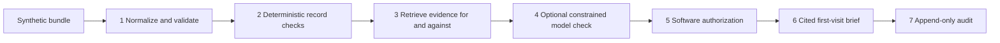

# Day One

An independent proposal for Clover Health /COMMIT by Rahul Chowdary Vajja. Day One assembles a cited first-visit record brief from 12 invented member histories. **ALL DATA IS SYNTHETIC.** It is an engineering and interview prototype with no clinical deployment, Clover integration, affiliation, or endorsement. [Live site](https://vajja1405.github.io/day-one/) (public). The downloadable `day-one-offline.html` runs directly in a browser with all data and assets embedded.

## Why I built it

Clover management described extending AI into insurance operations. I wanted to test what a constrained architecture could look like without assuming I know the company's workflow. The artifact is a care-record review, with abstention and contradictory evidence treated as useful outputs.

## The thesis

Management described roughly $70 PMPM of typical gross-profit improvement between a cohort's first and second years. Some portion might be attributable to acquiring and acting on information earlier, but the public disclosures do not quantify that portion. The prototype asks whether a cited first-visit brief could help bring useful context forward; it does not establish clinical or financial benefit.

The calculator exposes five inputs. Its defaults produce $37.00 million of modeled annual cohort gap, $12.21 million of assumed information component, and $6.10 million of illustrative annualized gross opportunity **before costs**. The 28% cohort share, 33% information share, and 50% acceleration share are author assumptions. This scenario does not model coverage, uptake, retention, costs, or a causal effect. Both information assumptions can be set to zero.

## Architecture



- **Deterministic before model:** explicit record assertions, recency, contradictions, and existing chart entries are handled in auditable rules first. These rules are deliberately narrow, not a general clinical natural-language system.
- **Typed boundaries:** Pydantic validates provenance, confidence ranges, status/action relationships, and citation requirements. `suggest_confirm` requires supporting evidence; `insufficient_evidence` has none.
- **Two-sided retrieval:** exact matching precedes an optional cached sentence-transformer/FAISS fallback. Explicit negation and later resolution are retained. General guidelines are kept separate from evidence about a member.
- **Software-owned permission:** no chart writes, prescriptions, or irreversible actions exist. Even valid optional model responses cannot override deterministic evidence sufficiency or supply rendered free-form prose.

The normal demonstration runs entirely in deterministic mode. Optional LLM calls are a constrained shadow check on unresolved candidates; they do not improve or change the shipped fixture decisions. The adapter accepts an OpenAI-compatible endpoint, validates JSON output, retries once, and retains the baseline on failure. Live provider compatibility and semantic model retrieval are not validated by the offline evaluation.

## Evaluation

The 30 labels span all 12 members: 8 supported, 8 absent, 6 contradicted, 4 adversarial, and 4 stale/superseded. Four stale cases expect `contradicted` because later records explicitly supersede them.

| Metric | Result |
|---|---:|
| Labeled status decisions | 30 / 30 |
| Abstention on absent + adversarial | 12 / 12 (100%) |
| Explicit contradiction detection | 6 / 6 (100%) |
| Stale/superseded suppression | 4 / 4 (100%) |
| Suggestions without supporting evidence | 0 / 72 displayed findings |
| Exact source citation checks | 100% |
| Descriptive expected calibration error | 0.1293 |
| Provider API cost per offline member | $0 |

| Status | Precision | Recall | F1 | Support |
|---|---:|---:|---:|---:|
| Suggest confirmation | 1.00 | 1.00 | 1.00 | 8 |
| Insufficient evidence | 1.00 | 1.00 | 1.00 | 12 |
| Contradicted | 1.00 | 1.00 | 1.00 | 10 |
| Already documented | — | — | — | 0 |

Already-documented suppression is covered by separate tests and the two charted fixtures. Citation checks establish exact source inclusion and date consistency, not clinical truth. Confidence is a heuristic for the predicted **record status**, not a disease probability. The reliability chart and ECE describe these same constructed fixtures; no calibration fitting was performed. Local latency measurements and full per-case outputs are in `evaluation/results.json`. The unsafe-suggestion metric raises and fails evaluation if above zero.

## Quickstart

Python 3.11+; tested here on Python 3.12. Use a virtual environment. Initial dependency installation requires network access or a prepared wheel cache. The subsequent generate/run/eval/export/test commands require no network or API key.

```sh
python3 -m venv .venv
. .venv/bin/activate
make install
make generate
make run
make eval
make test
make export
```

`make run` defaults to the contradictory member `SYN-007`. A fixed clinical review date of 2026-09-06 makes fixture recency reproducible. Run timestamps and audit identifiers are intentionally unique. `make serve` starts an optional localhost FastAPI API on port 8000; the website does not use it. No real-record upload endpoint exists.

Optional semantic dependencies are in `requirements-semantic.txt`; they require a separately cached `all-MiniLM-L6-v2` model and never download one during an offline run. See `.env.example` for the optional model adapter configuration. Do not place secrets in the website.

### Website

The site uses React + TypeScript and a plain Vite static build. It reads precomputed synthetic JSON bundled at build time. There is no runtime backend or model key. GitHub Pages serves only static assets; no server framework or model API is required.

```sh
cd site
npm ci
npm run dev
npm run build
npm run build:offline
npm run deploy
```

GitHub Pages publishes `site/dist/` from the `gh-pages` branch. Vite sets the base path to `/day-one/`. `npm run deploy` runs `gh-pages -d dist`; build first. The source is on `main` in [vajja1405/day-one](https://github.com/vajja1405/day-one). The standalone output is `site/offline-dist/day-one-offline.html`; opening it requires no server or installation. The embedded data is generated from `site/public/data/` by `node scripts/prepare-data.mjs` after `make export`. Builds run this preparation automatically.

The standalone document's calculator, member selection, evidence dialogs, evaluation, and audits work offline. External source links require an internet connection. The complete source is available in the [GitHub repository](https://github.com/vajja1405/day-one). The original self-contained offline backup is preserved at the repository root and copied to the deployed site at `/day-one/day-one-offline.html`.

## Audit properties

Each pipeline run appends a JSONL record with source excerpts and SHA-256 hashes, knowledge version/hash, fired rules, model-call metadata, candidate outcomes, permitted actions, and a brief hash. A hash chain provides edit detection when anchored to a trusted prior hash. Local append-only application behavior is **not** immutable storage against a filesystem administrator. The static exported records are illustrative snapshots.

## Limitations and what would make this real

All records, rules, and labels were authored for this prototype. There is no held-out cohort, clinician adjudication, real-world sensitivity measurement, medical-device validation, or patient outcome study. Condition matching covers a deliberately limited set of English assertions and may abstain or fail on unfamiliar language. Missing data means “not found in the supplied record,” not “care was missed.”

No treatment, diagnosis, coding submission, record retrieval, TEFCA exchange, or enrollment integration is performed. Clover's updated March 2026 Kno2 announcement describes responding to patient-directed data requests; it does not establish comprehensive inbound retrieval at enrollment. Real coverage is uneven, and this may duplicate internal work I cannot see.

To move beyond this proposal I would need the cohort-curve decomposition, coverage rates by market, access and consent requirements, real workflow observation, and a clinician to adjudicate several hundred appropriately governed cases.

## Public sources

- [Clover Q2 2026 earnings call](https://investors.cloverhealth.com/static-files/8940df35-b935-4f1d-b6e6-d931c1b7f885), August 5, 2026: $70 PMPM commentary, p. 3; AI operations direction, pp. 7–8.
- [Q2 earnings release, SEC exhibit](https://www.sec.gov/Archives/edgar/data/1801170/000180117026000196/a2q26exx991xearningsrelease.htm): 157,309 quarter-end members on June 30; average Q2 membership was 156,840.
- [Updated Kno2 announcement](https://investors.cloverhealth.com/news-releases/news-release-details/updated-moving-pledge-production-clover-health-now-live-kno2/), March 10, 2026: patient-directed clinical/claims exchange.
- [CMS payer pledgees](https://www.cms.gov/initiatives/health-technology-ecosystem/overview/early-adopters-all-pledgees/payers-their-delegated-technology), updated September 1, 2026.
- [KDIGO 2024 CKD guideline](https://kdigo.org/wp-content/uploads/2024/03/KDIGO-2024-CKD-Guideline.pdf): chronicity and longitudinal context.
- [NIDDK A1C reference](https://www.niddk.nih.gov/health-information/diagnostic-tests/a1c-test): diabetes monitoring context.
